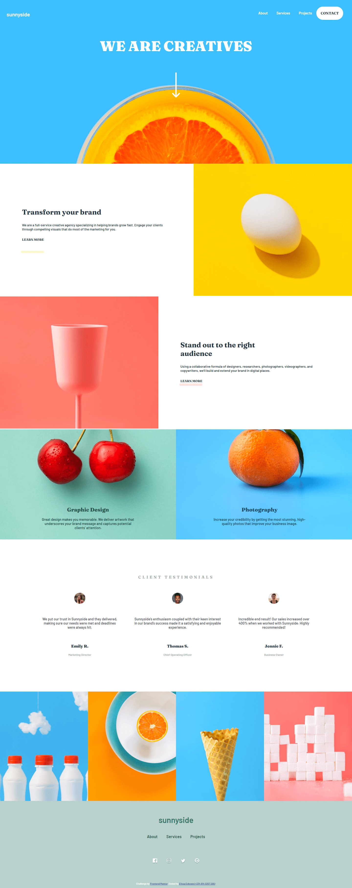
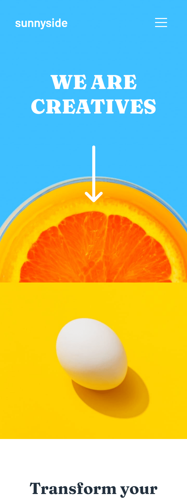
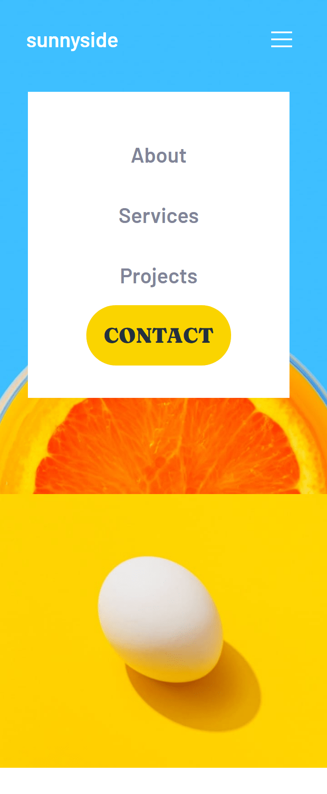

# Frontend Mentor - Sunnyside agency landing page solution

This is a solution to the [Sunnyside agency landing page challenge on Frontend Mentor](https://www.frontendmentor.io/challenges/sunnyside-agency-landing-page-7yVs3B6ef). Frontend Mentor challenges help you improve your coding skills by building realistic projects.

## Table of contents

- [Overview](#overview)
  - [The challenge](#the-challenge)
  - [Screenshot](#screenshot)
  - [Links](#links)
- [My process](#my-process)
  - [Built with](#built-with)
  - [What I learned](#what-i-learned)
  - [Continued development](#continued-development)
  - [Useful resources](#useful-resources)
- [Author](#author)
- [Acknowledgments](#acknowledgments)


## Overview

### The challenge

Users should be able to:

- View the optimal layout for the site depending on their device's screen size
- See hover states for all interactive elements on the page

### Screenshot
So sorry for these really big images.




### Links

- Solution URL: [Solution URL](https://your-solution-url.com)
- Live Site URL: [Live Site URL](https://efecollins.github.io/sunnyside/dist)

## My process

### Built with

- Semantic HTML5 markup
- CSS custom properties
- Flexbox
- CSS Grid
- Sass

### What I learned

Wow, good to be here completing this beautiful summer challenge. You know what after lots of writing of codes, I figured Flexbox is actually cool.
In times past, I was always thinking it's a tought thing but I used it pretty well here. I encourage everyone to learn CSS Flexbox as it's a very good thing to do.

While coding, I couldn't create hover  statesfor the social icons so it would be wonderful to find out how I got through that. Below is the code I used but do check the full code in dist folder. 

To see how you can add code snippets, see below:

```html
<div class="social-icons">
      
      
      
      
    </div>

    <div class="social-icons2">
      
      
      
      
    </div>
```

```css
footer .social-icons {
  text-align: center;
}

footer .social-icons img {
  padding: 20px;
  -webkit-transition: 0.3s;
  transition: 0.3s;
  cursor: pointer;
}

footer .social-icons img:hover {
  visibility: hidden;
}

footer .social-icons2 {
  position: relative;
  bottom: 65px;
  text-align: center;
  cursor: pointer;
}

footer .social-icons2 img {
  padding: 20px;
  -webkit-transition: 0.3s;
  transition: 0.3s;
}

footer .social-icons2 img:hover {
  visibility: hidden;
}
```


### Continued development

In the future which is ironically now, I would like to increase my JavaScript skills. I think of being the best Programmer in the world. If you with me, do follow.

### Useful resources

- [CSS Handbook](https://www.flaviocopes.com) - Flavio Copes books have been a great resourse for me, I just pray he sees this my review here. I got knowledge of CSS Flexbox and CSS Grid from his books.

## Author

- Website - [Efosa Collins Evbowe](https://efecollins.github.io/new-pweb/dist)
- Frontend Mentor - [@efecollins](https://www.frontendmentor.io/profile/efecollins)
- Twitter - [@EfeCollins7](https://www.twitter.com/EfeCollins7)

## Acknowledgments

I acknowledge The Most High God for keeping me alive while I was coding and even till now. Jesus loves you.
